# Orchestrator Helm charts

## Installation

- Check [orchestrator](./orchestrator/README.md) documentation and follow instructions.

## Configuration

### Cloudify:

- Once the `orchestrator` deployment is complete Cloudify's web console/interface will be accesible at
  `http[s]://cloudify.<exampledomain.eu>`.
  - Log in using "Username" `admin` and Cloudify's password (added to `cloudify` secret created during
    `orchestrator` [deployment](./orchestrator/README.md#orchestrator-chart)).

- Build [`croupier`](https://github.com/ari-apc-lab/croupier), a plugin for HPC and batch jobs orchestration in Cloudify:

  - Clone `croupier` repository into your local and checkout the branch you want to deploy:

    ```sh
    git clone https://github.com/ari-apc-lab/croupier.git
    cd croupier
    git checkout <master_dev>
    ```

  - Create `croupier` Python wagon issuing the following command:

    ```sh
    docker run -v <absolute_path_to_croupier_folder>:/packaging cloudifyplatform/cloudify-centos-7-py3-wagon-builder
    ```

    Output:

    ```
    Wagon created successfully at: ./croupier-3.2.0-centos-Core-py36-none-linux_x86_64.wgn
    ```

- Once the wagon is created, go to "Resources" > "Plugins" > "Upload" > "Upload a package":

  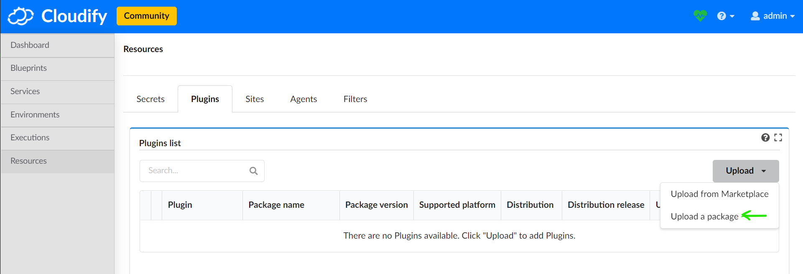

- Browse your system and fetch the created wagon and `plugin.yaml` (it belongs to `croupier/` repository):

  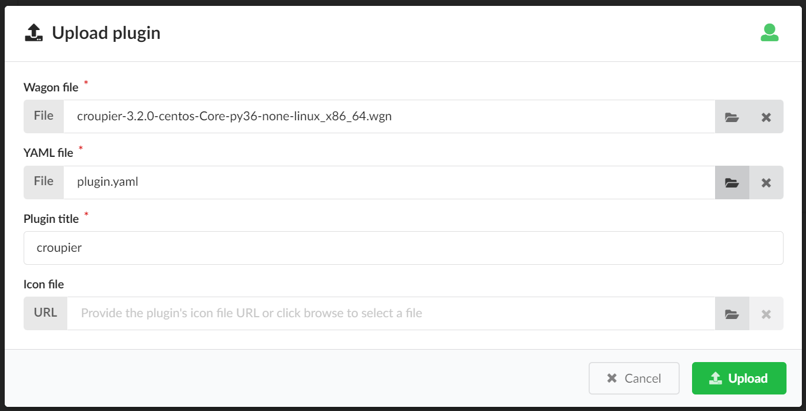

- After a few seconds `croupier` will be installed:

  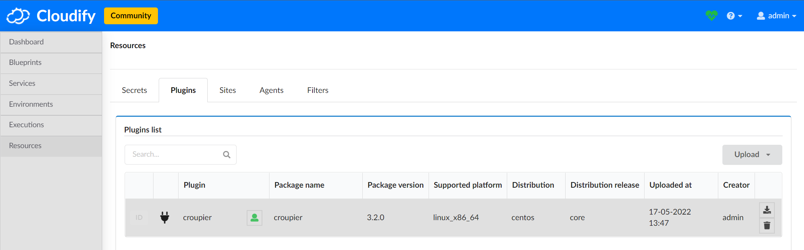

### Keycloak:

- Keycloak's web console/interface will be accesible at
  `http[s]://keycloak.<exampledomain.eu>`.
  - Log in using Keycloak's credentials (added to `keycloak` secret created
    during `orchestrator` [deployment](./orchestrator/README.md#orchestrator-chart)).
- Keycloak's required realm and client are automatically configured during `orchestrator`
  deployment using a Kubernetes job.
  This configuration can be manually extendended/modified using the web interface:
  - Add realm `<exampleRealm>`.
  - Create client `<exampleClient>`.
    - Settings:
      - Access_type: confidential
      - Implicit flow enabled: true
      - Valid redirect URIs: *
- Create users and set their passwords.
- Then get the "Client secret" from Keycloak and create the required K8s secret:
  - Go to "Configure" > "Clients" > "`<exampleClient>`":

    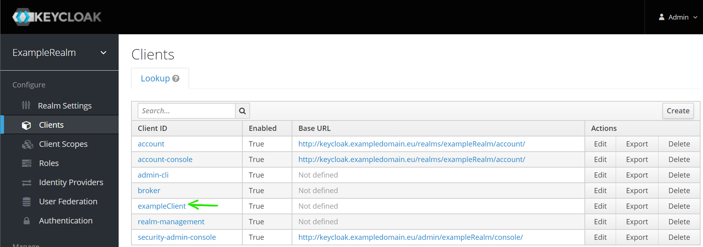

  - Go to "Credentials" > "Regenerate Secret" > Copy "Secret":

    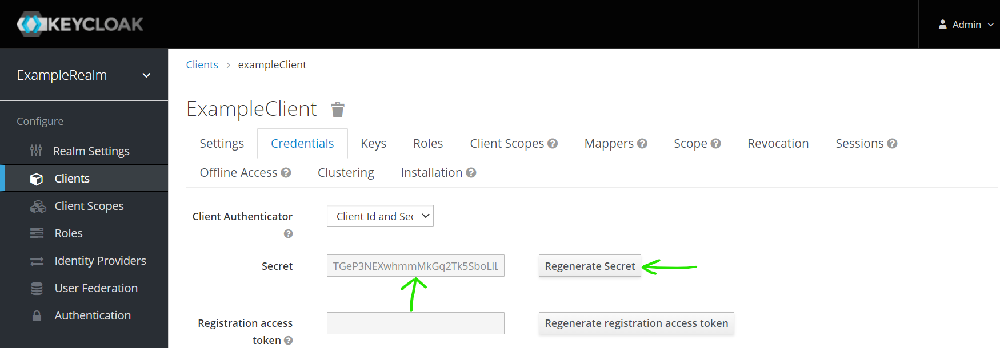

  - Create the following K8s secret using the copied "Secret":

    ```sh
    kubectl create secret generic keycloak-postinstall \
        -n <orchestrator> \
        --from-literal=client-secret='<keycloak-client-secret>'
    ```

    After that, `vault-secret-uploader` pod will change from `CreateContainerConfigError` to `Running` state.

### Vault:

- Vault's web console/interface will be accesible at `http[s]://vault.<exampledomain.eu>`.
  - Log in using "Method: Token" and Vault's token (added to `vault` secret created during
    `orchestrator` [deployment](./orchestrator/README.md#orchestrator-chart)).
- Add an authentication method:
  - Go to "Access" > "Authentication Methods" > "Enable new method":

    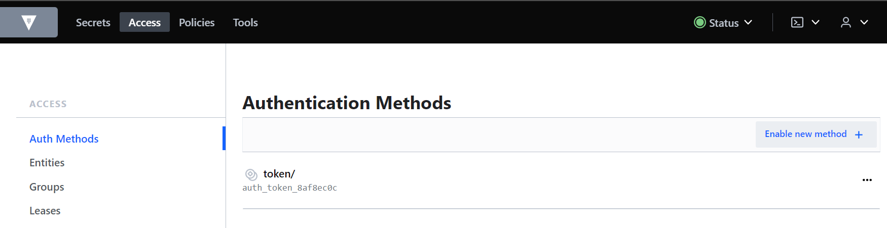

  - Choose "Generic" > "JWT" > "Next":

    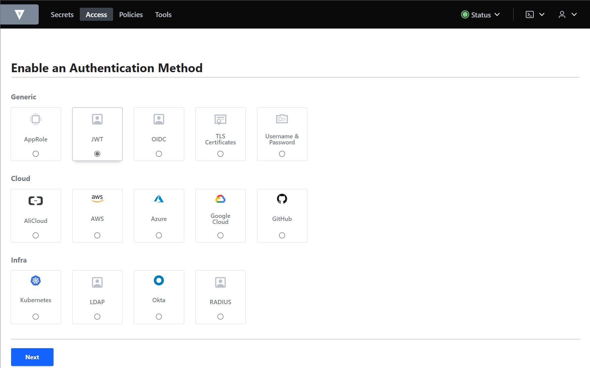

  - "Enable Method":

    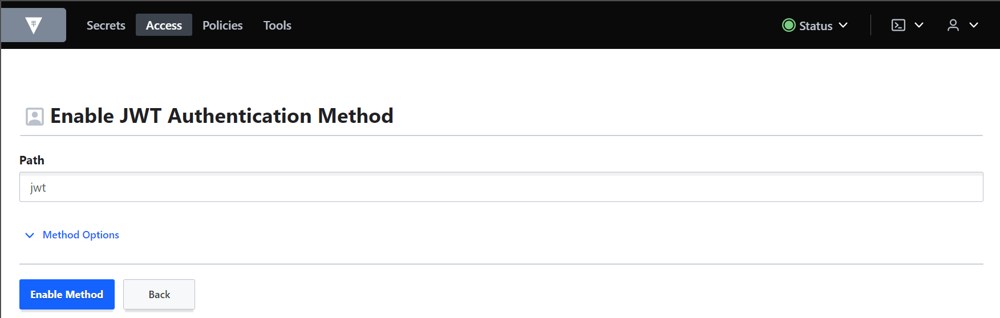

  - Then, under "Configure JWT", set the following url for "Jwks url" field and "Save":
    ```
    http://keycloak/realms/<exampleRealm>/protocol/openid-connect/certs
    ```
    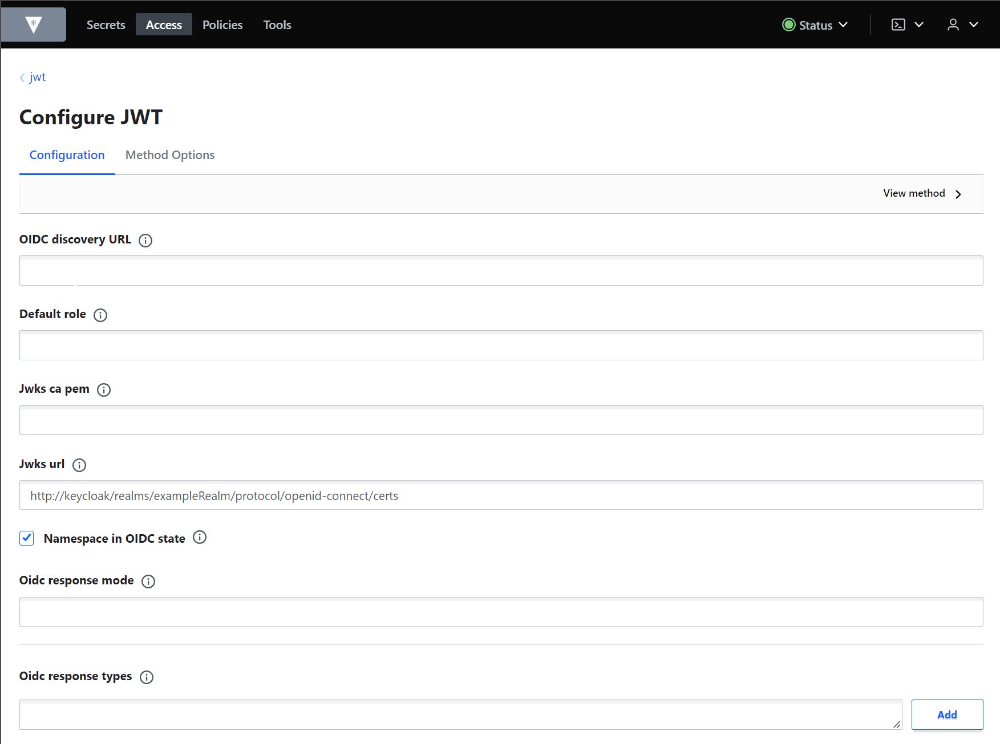

- Now let's configure the required Secrets Engines:
  - Go to "Secrets" > "Enable new engine":

    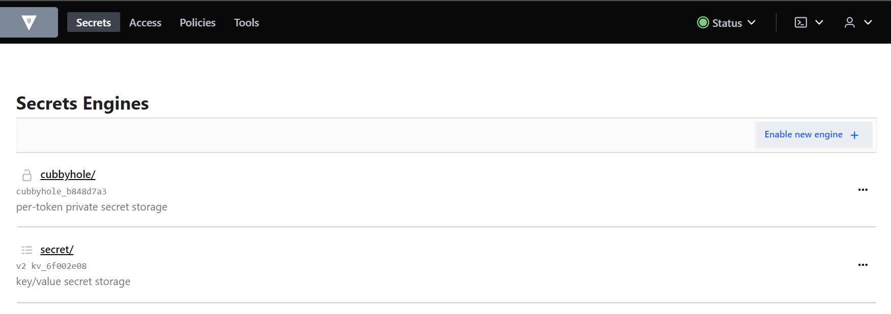

  - Choose "Generic" > "KV" > "Next":

    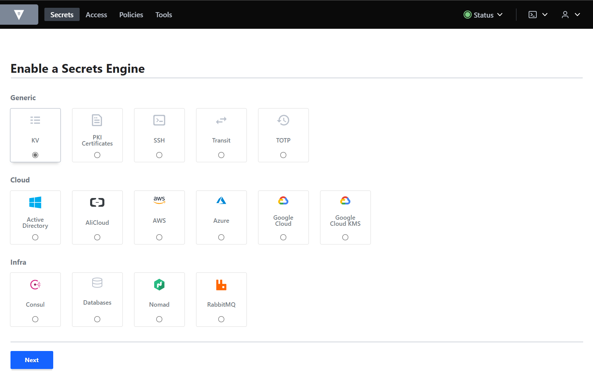

  - Type "croupier" in "Path" > Expand "Method options" tab > Select "Version" 1 > "Enable Engine":

      

  - Repeat the previous three steps replacing "croupier" by "ssh".
