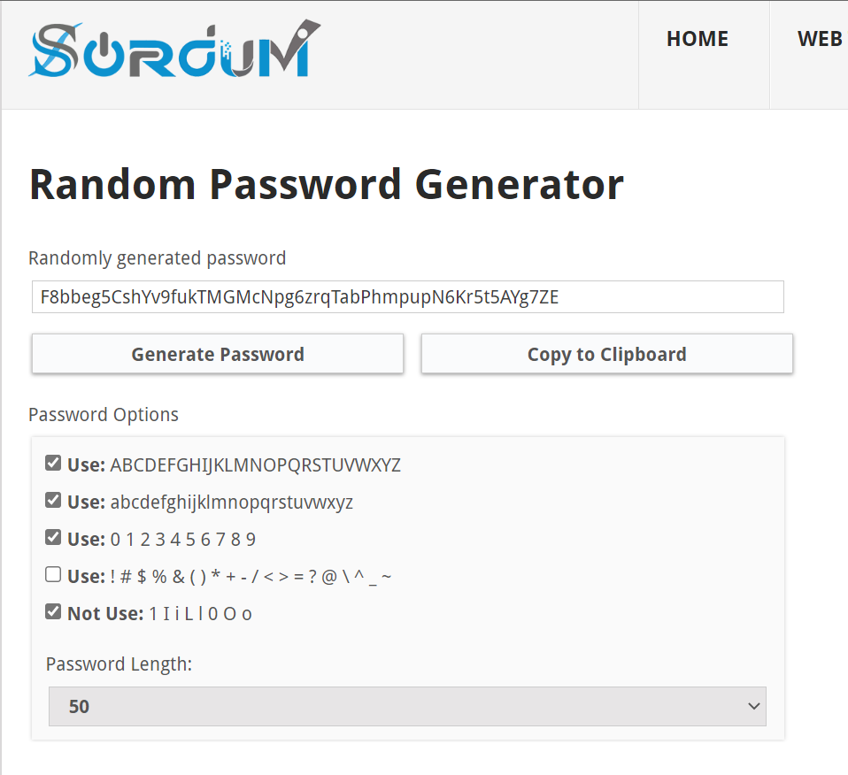
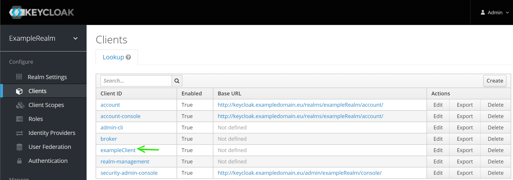
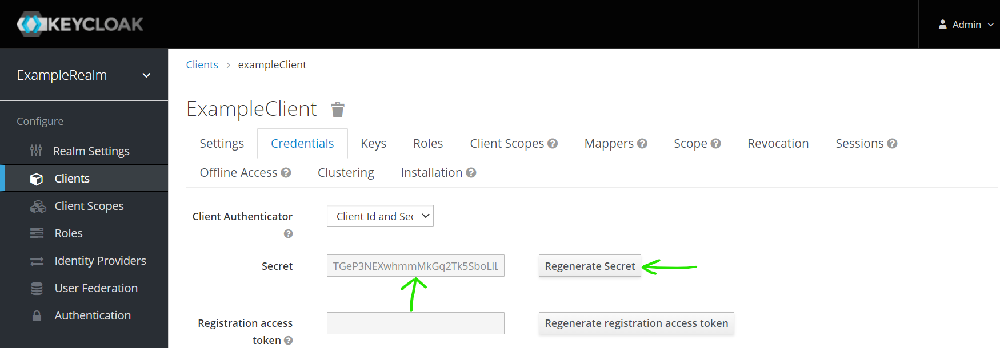
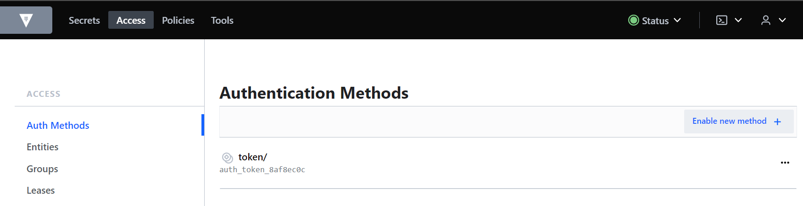
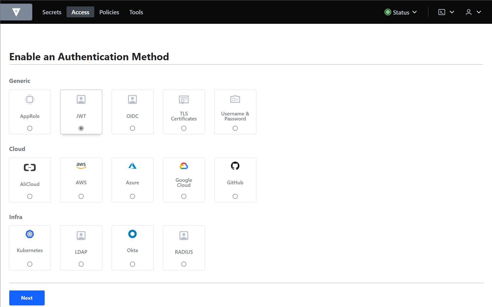
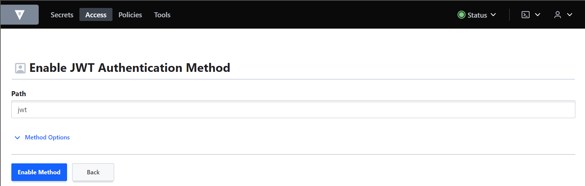
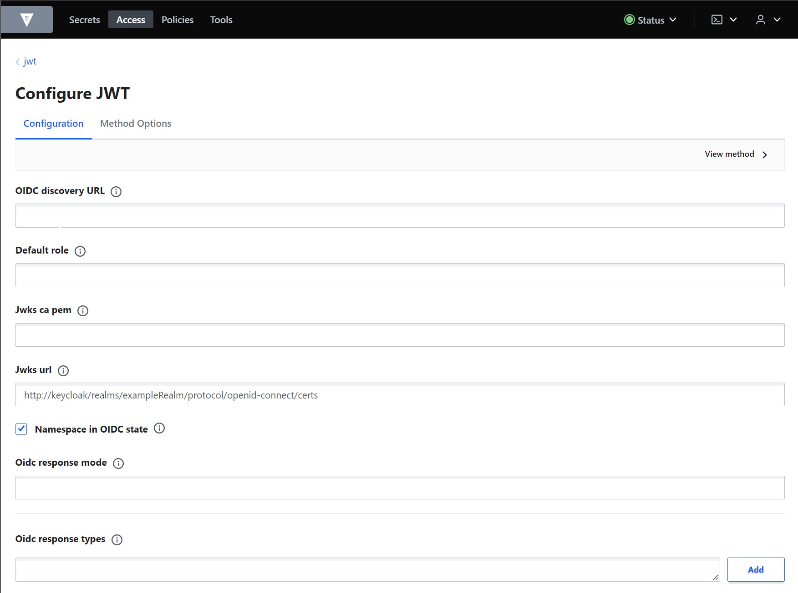
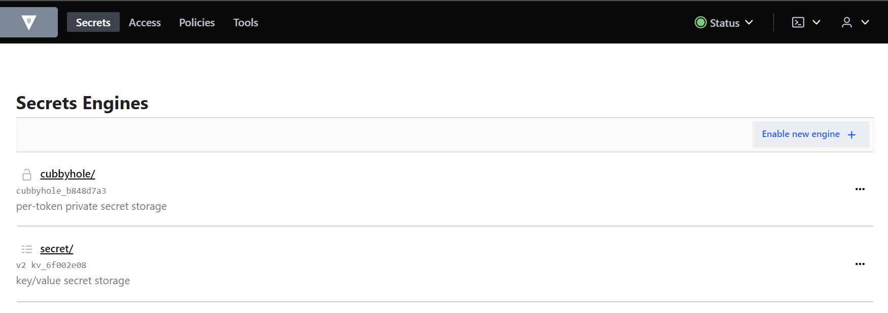
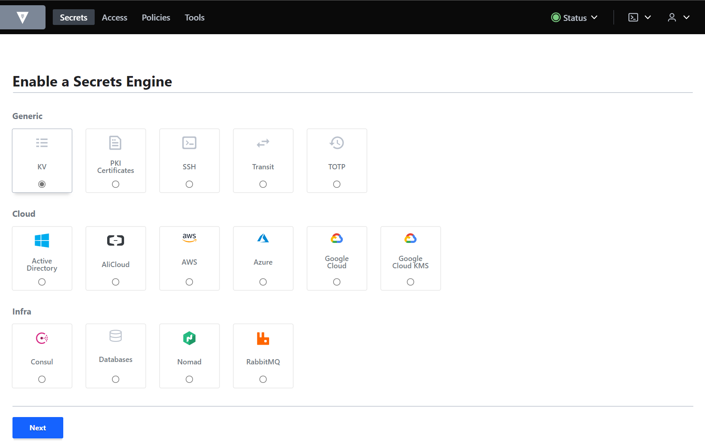
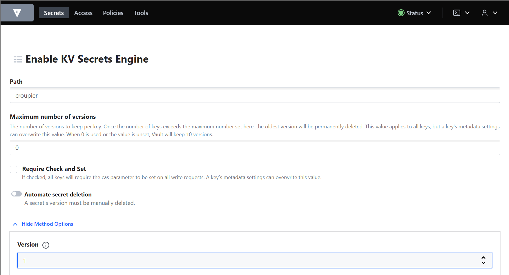

# Orchestrator Helm chart

## Description

It's a so called "umbrella" [Helm](https://helm.sh/) chart for the Orchestrator
as it contains the following charts/components:

| Chart                                | Component              |
|--------------------------------------|------------------------|
| [cloudify](../cloudify/README.md)    | Cloudify manager AIO   |
| [keycloak](../keycloak/README.md)    | Keycloak               |
| [vault](../vault/README.md)          | Vault                  |
| [vault-secret-uploader](../vault/README.md) | Vault secret uploader |

## Installation

### Requirements

- NGINX Ingress:

  If not installed, install the NGINX Ingress Controller in your Kubernetes cluster.

  **Note**: this is cluster-wide (the Ingress Controller requires a number of custom
  resource definitions (CRDs) installed in the cluster), so make sure you do not
  overwrite existing installation.

  Detailed information about installation using Helm can be found
  [here](https://github.com/nginxinc/kubernetes-ingress/tree/main/deployments/helm-chart#nginx-ingress-controller-helm-chart).

- Cert-manager:

  If you want to use TLS/HTTPS (termination at the Ingress level),
  configure Nginx to use production ready TLS certificates
  via [cert-Manager](https://cert-manager.io/).
  This is a Kubernetes addon to automate the management and issuance of TLS
  certificates from various issuing sources.
  It will ensure certificates are valid and up to date periodically, and
  attempt to renew certificates at an appropriate time before expiry.

  **Note**: this is cluster-wide (cert-manager requires a number of custom
  resource definitions (CRDs) installed in the cluster), so make sure you
  do not overwrite existing installation.

  Detailed information:
  - https://cert-manager.io/docs/usage/ingress/
  - https://www.digitalocean.com/community/tech_talks/securing-your-kubernetes-ingress-with-lets-encrypt
  - https://github.com/digitalocean/Kubernetes-Starter-Kit-Developers/blob/main/03-setup-ingress-controller/nginx.md#step-5---configuring-production-ready-tls-certificates-for-nginx
  - https://artifacthub.io/packages/helm/cert-manager/cert-manager

  To install cert-manager using Helm (release name `cert-manager`), run:

  ```sh
  # Add the Jetstack Helm repository
  helm repo add jetstack https://charts.jetstack.io

  # Install the cert-manager helm chart
  helm install cert-manager jetstack/cert-manager --version v1.8.0 \
      --namespace cert-manager \
      --create-namespace \
      --set installCRDs=true \
      --set prometheus.enabled=false
  ```

  To inspect Kubernetes resources created:

  ```sh
  kubectl get all -n cert-manager
  kubectl get crd -l app.kubernetes.io/name=cert-manager
  ```

  To uninstall/delete the cert-manager deployment:

  ```sh
  helm uninstall -n cert-manager cert-manager
  ```

  The previous command removes all the Kubernetes components associated
  with the chart (CRDs) and deletes the release.


### Orchestrator chart

This chart is intended to be installed as a whole to deploy all the components related to the Orchestrator.
Follow these steps:

- Create K8s namespace for the deployment:

  ```sh
  kubectl create ns <orchestrator>
  ```

- Create K8s required secrets. These will contain credentials for Cloudify,
  Keycloak and Vault:

  ```sh
  kubectl create secret generic cloudify \
    -n <orchestrator> \
    --from-literal=cloudify-admin-pw='<adminPassword>'

  kubectl create secret generic keycloak \
    -n <orchestrator> \
    --from-literal=keycloak-admin='<adminId>' \
    --from-literal=keycloak-admin-pw='<adminPassword>'

  kubectl create secret generic vault \
    -n <orchestrator> \
    --from-literal=root-token='<adminToken>'
  ```

  Note: you can use a random password/token generator like
  [Sordum](https://www.sordum.org/passwordgenerator/)
  to fill the secrets (especially for Vault's token), e.g.:

  

- It is possible to check whether the secrets were created properly, e.g.:

  ```sh
  kubectl get secrets -n <orchestrator> keycloak -o jsonpath='{.data.keycloak-admin}' | base64 --decode
  ```

- Update chart dependencies:

  ```sh
  helm dependency update .
  ```

- Optional: add project-specific configuration `<project>.yaml` under `./values/`:

  ```yaml
  # Values for orchestrator umbrella chart.
  #   Project: Example
  #
  # This is a YAML-formatted file.

  global:
    projectDomain: "exampledomain.eu"
    tls:
      enabled: false
    config:
      keycloakRealm: "exampleRealm"
      keycloakClient: "exampleClient"
  ```


- Finally, deploy Orchestrator's chart:

  ```sh
  helm install orchestrator . [-f ./values/<project>.yaml] -n <orchestrator>
  ```

  Notes:
  - use "`-f ./values/<project>.yaml`" option to apply project-specific values.
  - `vault-secret-uploader` pod will remain in state `CreateContainerConfigError`
    until `keycloak-postinstall` secret is created. See next section for more information.
  - chart deployment will be finished once the status of `keycloak-configjob` job
    becomes "Completed".

### Keycloak configuration:

- Once the deployment is complete Keycloak's web console/interface will be accesible at
  `http[s]://keycloak.<exampledomain.eu>`.
  - Log in using Keycloak's credentials (added to `keycloak` secret created above).
- Keycloak's required realm and client are automatically configured during Orchestrator
  deployment using a Kubernetes job.
  This configuration can be manually extendended/modified using the web interface:
  - Add realm `<exampleRealm>`.
  - Create client `<exampleClient>`.
    - Settings:
      - Access_type: confidential
      - Implicit flow enable: true
      - Valid redirect URIs: *
- Create users and set their passwords.
- Then get the "Client secret" from Keycloak and create the required K8s secret:
  - Go to "Configure" > "Clients" > "`<exampleClient>`":

    

  - Go to "Credentials" > "Regenerate Secret" > Copy "Secret":

    

  - Create the following K8s secret using the copied "Secret":

    ```sh
    kubectl create secret generic keycloak-postinstall \
        -n <orchestrator> \
        --from-literal=client-secret='<keycloak-client-secret>'
    ```

    After that, `vault-secret-uploader` pod will change from `CreateContainerConfigError` to `Running` state.

### Vault configuration:

- Vault web console/interface will be accesible at `http[s]://vault.<exampledomain.eu>`.
  - Log in using "Method: Token" and Vault's token (added to `vault` secret created above).
- Add an authentication method:
  - Go to "Access" > "Authentication Methods" > "Enable new method":

    

  - Choose "Generic" > "JWT" > "Next":

    

  - "Enable Method":

    

  - Then, under "Configure JWT", set the following url for "Jwks url" field and "Save":
    ```
    http://keycloak/realms/<exampleRealm>/protocol/openid-connect/certs
    ```
    

- Now let's configure the required Secrets Engines:
  - Go to "Secrets" > "Enable new engine":

    

  - Choose "Generic" > "KV" > "Next":

    

  - Type "croupier" in "Path" > Expand "Method options" tab > Select "Version" 1 > "Enable Engine":

      

  - Repeat the previous three steps replacing "croupier" by "ssh".
